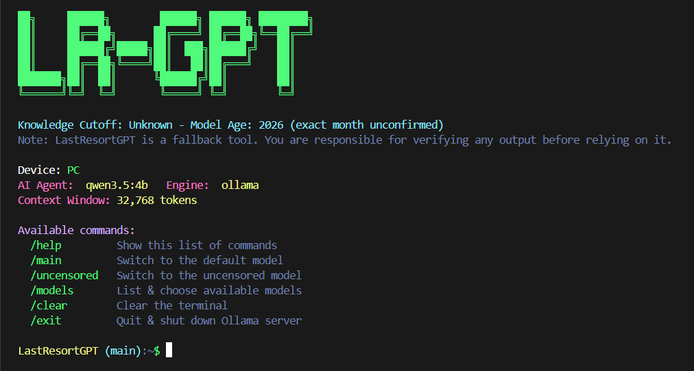
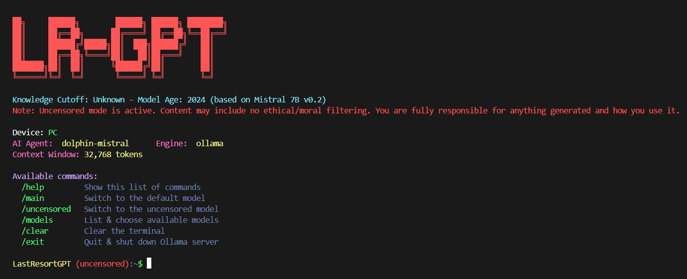
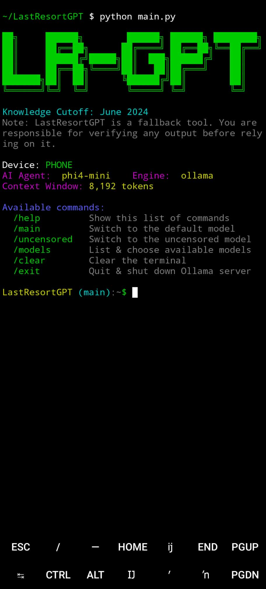

# LastResortGPT



A fully offline personal AI assistant, built for the moments when you have no internet and no other AI access at all: a genuine last resort, not a daily driver. Runs entirely on your own device (phone via Termux, or PC) using a local model through Ollama, with no cloud API, no account, and no internet dependency once set up.

It also works on Android via Termux, in addition to Windows, macOS, and Linux.

## Prerequisites

* Python 3.9+
* git (to clone this repo)
* Ollama (see installation below)
* Roughly 6 to 10 GB free storage, depending on which models you install (see Storage section below)

## Installation

### 1. Install Ollama

**Windows / macOS**
Download the installer from ollama.com/download and run it, or install via PowerShell:
```
irm https://ollama.com/install.ps1 | iex
```

**Linux / Termux (Android)**
```
pkg install ollama -y
```
On Linux desktops without `pkg`, use the official install script from ollama.com instead.

Verify it installed correctly:
```
ollama --version
```

### 2. Install Python dependencies

```
pip install pylatexenc
```

**Why:** LastResortGPT renders math and LaTeX (fractions, square roots, boxed answers, Greek symbols, etc.) directly in your terminal. Rather than hand-maintaining our own dictionary of symbols and regex patterns, which breaks the moment a model outputs a LaTeX command we didn't think to add, `pylatexenc` is a real LaTeX parser. It already understands hundreds of macros (`\frac`, `\sqrt`, `\boxed`, `\pi`, and far more) and handles all common math delimiters (`$...$`, `$$...$$`, `\(...\)`, `\[...\]`) correctly. This makes our math rendering scalable: new LaTeX commands a model outputs are very likely already supported, with zero code changes required on our end.

### 3. Clone this repository

```
git clone https://github.com/WilburStanley/LastResortGPT.git
cd LastResortGPT
```

### 4. Pull the AI agents (models)

```
ollama pull qwen3.5:4b
ollama pull phi4-mini
ollama pull dolphin-mistral
```

You don't strictly need all three. See the Models section below for what each is used for and whether you need it on your specific device.

## Storage Space Needed

| Model | Approx. size | Used on |
|---|---|---|
| `phi4-mini` | ~2.5 to 3.8 GB | Phone |
| `qwen3.5:4b` | ~3.4 GB | PC |
| `dolphin-mistral` | ~4 GB | Both (uncensored mode) |

Phone: budget at least 4 to 5 GB free (for `phi4-mini` plus `dolphin-mistral`).
PC: budget at least 7 to 8 GB free if you install all three.

You don't have to install every model on every device. Only pull what you'll actually use there.

## Running LastResortGPT

### Start the Ollama server

```
ollama serve > /dev/null 2>&1 &
```

This single command has three parts, each doing something specific:

1. **`ollama serve`** starts Ollama's local server. This is the actual program that loads the AI model into memory and answers requests. Nothing else in this app works until this is running.
2. **`> /dev/null 2>&1`** redirects Ollama's own internal logs somewhere they won't clutter your screen. Ollama normally prints a lot of technical output as it runs; this simply hides that noise so LastResortGPT's own output stays clean. It does not change what Ollama does, only what you see.
3. **`&`** runs the whole command in the background of your current terminal window, so your terminal is free to keep accepting other commands (like `python main.py`) instead of being stuck waiting on `ollama serve` forever.

**Why this is not a hidden background service:** the AI agent only ever runs because you personally typed this command in this specific terminal session. It is not installed as a startup service, it does not launch when your device boots, and it is not running unless you explicitly started it. Typing `/exit` inside LastResortGPT (or plain `exit` / `quit`) properly shuts this process down when you're done.

### Run the app

```
python main.py
```

### If the AI agent gets stuck running when you didn't mean it to

Normally, `/exit` fully shuts down the Ollama server for you. But if you close the terminal window directly, or press Ctrl+C instead of using `/exit`, Ollama's server process can be left running in the background even though LastResortGPT itself has closed. This means the AI agent could still be sitting active on your device without you realizing it.

**Check if it's still running:**

Windows (PowerShell or Command Prompt):
```
tasklist | findstr ollama
```

Linux / macOS / Termux:
```
ps aux | grep ollama
```

You can also ask Ollama itself which models are currently loaded and active in memory:
```
ollama ps
```
If this shows a model listed, Ollama is actively running right now.

**Forcefully shut it down:**

Windows:
```
taskkill /IM ollama.exe /F
```

Linux / macOS / Termux:
```
pkill ollama
```

Running these commands is exactly what LastResortGPT's own `/exit` command does automatically. This section exists for the case where `/exit` wasn't used, so you always have a manual way to confirm nothing is quietly running in the background.

## Commands

| Command | What it does |
|---|---|
| `/help` | Show the list of available commands |
| `/main` | Switch to the default model for your device |
| `/uncensored` | Switch to the uncensored model |
| `/models` | List every model in your config and pick one manually |
| `/clear` | Clear the terminal screen |
| `/exit` (or `exit` / `quit`) | Quit the app and fully shut down the Ollama server |

## Managing Installed Models

List everything you've installed:
```
ollama list
```

Delete a model you no longer need (frees disk space):
```
ollama rm <model-name>
```
Example: `ollama rm gemma3:4b`

These commands work identically on Windows, Linux, macOS (Darwin), and Termux/Android. `ollama list` and `ollama rm` are Ollama's own commands, not something this app wraps differently per platform.

## Design and Context Explanations

### How the confidence score actually works

Most naive approaches ask the AI model itself "how confident are you?" but this is unreliable, since a model can state high confidence even when it's wrong. It's reporting a feeling, not a measurement.

Instead, LastResortGPT reads the model's actual token level probabilities (log probabilities) directly from Ollama's API during generation, the literal internal likelihood the model assigned to each word it chose, not a self report. These are averaged and converted into a percentage.

One real caveat, stated plainly: this measures how predictable the model's wording was, not how factually correct the answer is. A short, deterministic answer ("2+2" to "4") will almost always score higher than a fully correct but open ended explanation (like defining a word), simply because open ended prose has many equally valid ways to be phrased, which naturally lowers the average token probability. A low score does not mean the answer is probably wrong. It can just mean the question was open ended.

For models with a thinking phase (see below), the confidence calculation specifically excludes the internal reasoning tokens and only scores the final answer. Thinking tokens are inherently more exploratory and uncertain by nature, and including them would unfairly drag down the score of a perfectly good final answer.

### How the "thinking" process works, and why the system prompt speeds things up

Some models (like Qwen) support an internal reasoning phase, generating step by step thinking before their final answer, before giving a direct answer. Think of this as an optional "off by default" reasoning mode: for everyday, simple questions, no extended reasoning is needed at all, and skipping it is both faster and just as accurate. Reasoning only earns its cost on genuinely hard, multi step problems.

LastResortGPT handles this automatically:

1. Every question is first tried with reasoning turned off. Fast, direct, no wasted effort.
2. If that attempt comes back empty (meaning the model genuinely needed to reason it through to produce anything at all), it automatically retries with reasoning turned on and a larger token budget.

This means simple questions stay fast, and only genuinely difficult ones pay the slower reasoning cost.

Separately, a system prompt instructing the model to be direct and concise (rather than verbose, with unnecessary preamble) meaningfully improves both speed and confidence. Shorter, more direct answers generate faster on limited hardware, and tend to have higher average token confidence than rambling, hedging responses.

### How LaTeX and Markdown are handled

Model responses often come back in Markdown (bold text, code blocks, headers, bullet lists) and LaTeX (math notation). Since we're in a plain terminal, none of this renders natively, so LastResortGPT converts it:

Bold, headers, bullet lists, inline and fenced code are converted to real terminal colors via ANSI codes.

LaTeX (`$...$`, `$$...$$`, `\(...\)`, `\[...\]`, and macros like `\frac`, `\sqrt`, `\boxed`, `\pi`) is parsed and converted to readable text and Unicode using the `pylatexenc` library, rather than a hand maintained symbol dictionary. This makes it scalable: supporting a new LaTeX command the model outputs doesn't require us to write new code.

### Models, and why each one was chosen

| Role | Model | Device | Why |
|---|---|---|---|
| Main | `qwen3.5:4b` | PC | Newer generation model, more capable reasoning, PC has the RAM and thermal headroom to run it comfortably. |
| Main | `phi4-mini` | Phone | Does not have a separate reasoning phase, so it answers directly and consistently. Critical for phone hardware, where forced internal reasoning (as seen with Qwen family models) made responses unacceptably slow. Also benchmarks strongly for its size on math and reasoning tasks. |
| Uncensored | `dolphin-mistral` | Both | A well established, widely used less filtered model, chosen over lesser known community uploads specifically because it has a longer track record and more real world use than an unverified small upload. |

**On uncensored mode:** this mode removes standard content moderation from responses. It is entirely opt in (`/uncensored` command) and clearly marked in red throughout the interface whenever active. All responsibility for content generated in this mode, and how it is used, rests entirely with the user.

### Context window explained

The context window is how much conversation (in tokens, pieces of words) the model can hold in memory at once, including everything you've said in the current session with that model. Each model keeps its own separate, continuous memory. Switching between `/main` and `/uncensored` doesn't mix their conversation history.

Context window size is set per device, since it directly costs RAM: phone gets a smaller window to stay reliable on limited hardware, PC gets a much larger one. These values live in `config/models.json` as `context_window_phone` and `context_window_pc`, and can be adjusted there directly if you find your device can handle more or less.

### What num_predict does, and how it relates to context window

`num_predict` is a separate setting from context window, and it's easy to confuse the two. Context window is the model's total memory space, everything it can "see" at once: your question, the conversation history, and the space needed for its own answer, all combined. `num_predict` is a smaller, specific cap inside that space: the maximum number of tokens the model is allowed to generate for a single response.

Why this cap exists at all: without one, a response (especially during a reasoning phase) could theoretically run on indefinitely, eating the entire context window and leaving zero room for anything else, including the conversation history you've built up. Capping it keeps a single answer from ever being able to consume the whole window by itself.

**The math we used:** `num_predict` is set to exactly 25 percent of that device's context window.

```
num_predict = context_window * 0.25
```

For example, with `context_window_phone` set to 8192, `num_predict_phone` is 2048 (8192 times 0.25). With `context_window_pc` set to 32768, `num_predict_pc` is 8192 (32768 times 0.25).

**Why 25 percent specifically:** this leaves 75 percent of the context window free for everything else, your prompt, the model's internal reasoning if it needs to think, and your accumulated conversation history across the session. A single response is given a generous amount of room to actually finish (unlike a very small fixed cap, which can cut a model off mid-thought with no answer at all), while still guaranteeing the majority of the window stays available for ongoing memory, rather than one reply being allowed to consume everything.

**If you change a model's context window,** recalculate its matching `num_predict` using this same ratio, rather than leaving the old value in place. Example: if you raise `context_window_phone` to 16384 for a more capable phone, its `num_predict_phone` should become 4096 (16384 times 0.25) to keep the same proportion.

One more thing worth knowing: this value is only a starting point, not a hard ceiling. If a response comes back empty because the model ran out of room mid-reasoning, LastResortGPT automatically retries that same question with double the `num_predict` value, so genuinely difficult questions still get a real shot at a complete answer even if the initial cap wasn't quite enough.

## Customizing Models

Every model's behavior is defined in `config/models.json`. No code changes needed to add, remove, or retune a model:

```json
{
    "model-name": {
        "cutoff": "when its training data ends",
        "engine": "ollama",
        "role": "main | uncensored",
        "device": "phone | pc | both",
        "context_window_phone": 8192,
        "context_window_pc": 32768,
        "num_predict_phone": 2048,
        "num_predict_pc": 8192
    }
}
```

To add a new model, run `ollama pull <model-name>`, then add a matching entry here. To change which model is your default, edit the `role` and `device` fields. The app reads this config fresh every time it starts.

Display on Uncensored mode



Display on Android via Termux

